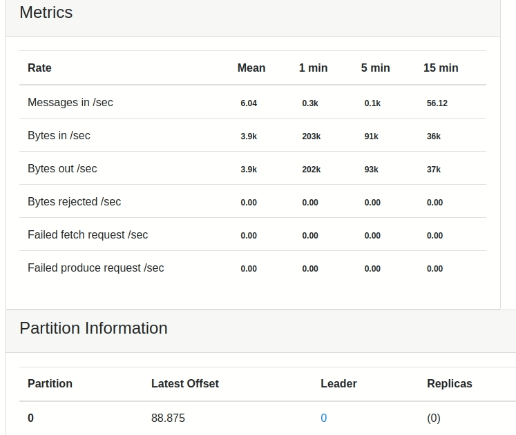
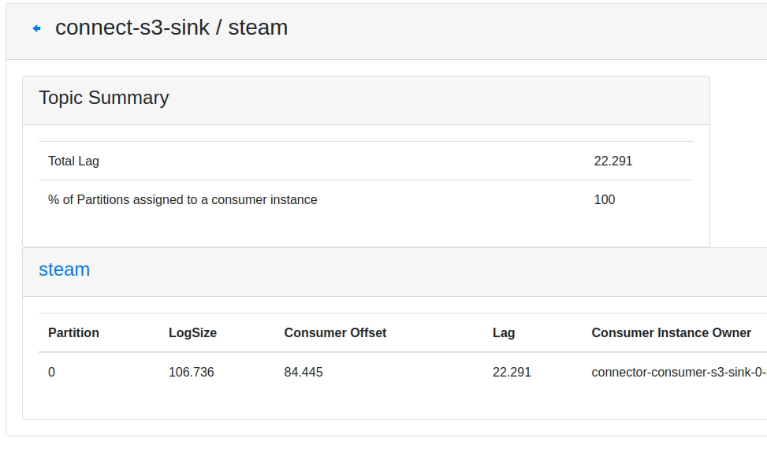

# Facens_Architecture_for_Data_Processing

O objetivo deste projeto é simular em uma escala reduzida a aplicação de tecnologias de Big Data para criação de uma repositório para Sistemas de Recomendação.

Os códigos e comentários deste repositório se referem a parte prática do TCC da pós gradução em Ciências de Dados pela Facens.

# Arquitetura

A arquitetura implementada foi a seguinte:

## Fonte de Dados

Para este projeto a principal fonte de dados utilizada, trata-se de uma API pública da Steam, com reviews de usuários em relação aos jogos. A API retorna um objeto JSON com as seguintes informações:

A API requer como parâmetro o "appid" do game que se deseja obter as informações, para isso, utilizou-se como ponto de partida um dataset já existente. O dataset em questão foi postado na plataforma do Kaggle pelo usuário Marko M. e contém 21.947.105 registros.

Dataset disponível em: https://www.kaggle.com/datasets/najzeko/steam-reviews-2021

# Fase 1 - Ingestão do dataset 

A primeira etapa do trabalho foi carregar todos esses registros para o bucket, na camada Bronze (ingestão).

Após isso, foi aplicado um Spark job para levar os dados para a camada Silver, na qual foi aplicado um agrupamento dos dados por APPID e convertido para .parquet.

Desta forma identificou-se inicialmente que no dataset havia 65.580 potenciais jogos. Observou-se também uma redução significativa no volume dos dados.

Os dados ficaram organizados da seguinte forma neste bucket.

Após isso, foi realizado um mapeamento dos nomes e dos id's de recomendação localizados na base, toda essa informação foi disponibilizada em uma coleção no MongoDB.

Desta forma é possível ter alguns meta dados sobre os dados armazenamos no bucket.

Realizado este mapeamento a próxima etapa foi filtrar os jogos de interesse para levar para a bucket Gold, onde os dados estão na formatação final desejada.

Foram selecionados inicialmente 320 jogos para serem enviados a camada Gold e iniciar o processo de coleta de dados via API.

# Fase 2 - Ingestão em batch de novos reviews

Após a coleta e tratamento do dataset inicial do projeto, a segunda etapa foi implementar a arquitetura responsável por coletar os novos reviews do jogos, a partir do ultimo ID identificado anteriormente para os jogos que foram enviados até a camada Gold.

## Kafka

Neste projeto a coleta de review foi implementada com a ferramenta Apache Kafka. 

Portanto a ingestão dos dados da API irá ocorrer da seguinte forma, por meio do Apache Kafka, será realizado a leitura do ultimo review coletado, para cada jogo presente na camada Gold.

Após isso o Kafka será responsável por publicar os dados coletados no tópico "steam".

Este projeto utilizou o CMAK (Cluster Manager for Apache Kafka) para ter uma interface gráfica que facilitar a criação de cluster e tópicos no Kafka.

O CMAK também fornece diversas metricas e funcionalidades que auxiliam muito na criação e manutenção dos tópicos.

É possível vizualizar o volume de dados que estão sendo produzidos:

Neste projeto foi configurado um conector do Apache Kafka com o bucket Minio, desta forma é possível ver o volumes de dados que foram consumidos.

## Minio

Todos esses dados coletados foram armazenamos no Object Storage MiniO, neste projeto foi implementado uma arquitetura de bucket similiar ao que existe no Deltalake da Databricks.

Após implementado, ficou desta forma:

## Spark

Após o Kafka realizar a ingestão e disponibilizar os dados na camada Bronze, o pipeline avança para o processamento destes dados com o Spark.

Para essa etapa foram desenvolvidas 2 funcões, nomeadas de "fn_move_from_bronze_to_silver" e "fn_move_from_silver_to_gold".

Na função "fn_move_from_bronze_to_silver" o objetivo é realizar a leitura de todos os reviews que foram ingeridos (e estão na camada bronze), após isso foi aplicado uma conversão nos campos de data, remoção dos duplicados e renomeado a coluna appid, após esses tratamentos os dados são enfim salvos na camada bronze particionados por app_id e no formato .parquet

~~~python
def fn_move_from_bronze_to_silver():

  try:
    logging.info(f'Iniciando leitura dos dados na camada Bronze.')  
    df = spark.read.json('s3a://bronze/topics/steam/*', multiLine=True)

    logging.info(f'Convertendo colunas de timestamp para datetime.')
    df.withColumn('last_played', f.date_format(df.last_played.cast(dataType=t.TimestampType()), "yyyy-MM-dd")) \
      .withColumn('timestamp_created', f.date_format(df.timestamp_created.cast(dataType=t.TimestampType()), "yyyy-MM-dd")) \
      .withColumn('timestamp_updated', f.date_format(df.timestamp_updated.cast(dataType=t.TimestampType()), "yyyy-MM-dd"))

    df2 = df.withColumn('last_played', f.to_date(df.last_played.cast(dataType=t.TimestampType()))) \
            .withColumn('timestamp_created', f.to_date(df.timestamp_created.cast(dataType=t.TimestampType()))) \
            .withColumn('timestamp_updated', f.to_date(df.timestamp_updated.cast(dataType=t.TimestampType())))

    df2 = df2.withColumn("last_played",f.to_timestamp(df2['last_played'])) \
            .withColumn("timestamp_created",f.to_timestamp(df2['timestamp_created'])) \
            .withColumn("timestamp_updated",f.to_timestamp(df2['timestamp_updated']))

    logging.info(f'Removendo registros duplicados.')
    df3 = df2.drop_duplicates()
    logging.info(f'Renomeando coluna appid para app_id')
    df3 = df3.withColumnRenamed('appid', 'app_id')
    logging.info(f'Enviando dados tratados para camada Silver')
    df3.write.partitionBy('app_id').mode('append').parquet('s3a://silver/steam_reviews/reviews.parquet')

    logging.info(f'Movendo arquivos lidos para bucket de processados')
    fn_move_files(bucket='bronze', sourcePath='topics/steam/partition=0/', destinationPath='processed_files/steam/')

  except Exception as e:
    logging.info(f'Error {e}')
    print('Processo sendo encerrado.')
    pass

  return 0
~~~

Após isso a segunda função a ser chamada é a "fn_move_from_silver_to_gold"

Seu objetivo é tranportar para a camada gold apenas os novos reviews dos jogos que já foram mapeados para a camada gold.

Como mencionado anteriormente, neste projeto foi escolhido em torno de 320 jogos para serem enviados a camada gold e receberem constantemente novos reviews. 

Nesta função existe um processo de verificar quais arquivos já foram importados (está informação é buscada nos metadados que estão no MongoDB)

Então é feito um cruzamento de todos os arquivos que estão na camada silver x arquivos que foram processados, assim o processo somente irá levar para a Gold os novos.

Após a implementação a função ficou assim:

~~~pyt
def fn_move_from_silver_to_gold():

    app_id = fn_get_games_in_gold_layer()

    for appid in app_id:
        #1º Busca as informações na camada silver.
        prefix = '/steam_reviews/reviews.parquet/app_id=' + str(appid) + '/'
        game_info = get_silver_layer_metadata(prefix)
        
        #2º Busca quais são os arquivos já processados.
        path_processed_files = get_mongodb_metadata(appid)
        
        for path in path_processed_files:
            for index, game in enumerate(game_info):
                game_info.pop(index) if path in game['silverPath'] else None
            
        #4º Iniciando leitura dos dados e envio para camada Gold.
        if len(game_info) > 0:
            for game in game_info:
                df = spark.read.parquet('s3a://silver/' + game['silverPath'], multiLine=True, header=True, schema=reviews_schema) 

                df = df.withColumn("appid", lit(game['appid']))

                try:

                    df2 = df.select('appid', 'recommendationid', 'language', 'steamid',\
                    'playtime_last_two_weeks', 'num_games_owned', 'playtime_forever',\
                    'review', 'votes_up', 'votes_funny', 'timestamp_created')

                    df2.write.partitionBy('appid').mode('append').parquet('s3a://gold/steam_reviews/reviews.parquet')

                except Exception as e:

                    df.write.partitionBy('appid').mode('append').parquet('s3a://gold/steam_reviews/reviews.parquet')

                finally:
                    #Aualiza os metadados, adicionando os paths dos arquivos processados.
                    update_path_list(appid, game['silverPath'])

    return 0
~~~

# Fase 3 - Orquestração

Após o desenvolvimento e testes de todo o processo a etapa final é automatizar a execução destas rotinas, para isso foi desenvolvido uma DAG no Airflow que executa os 3 processo (extração dos reviews, enviado da bronze para silver, e da silver para gold)

Visualmente a DAG ficou desta forma:

