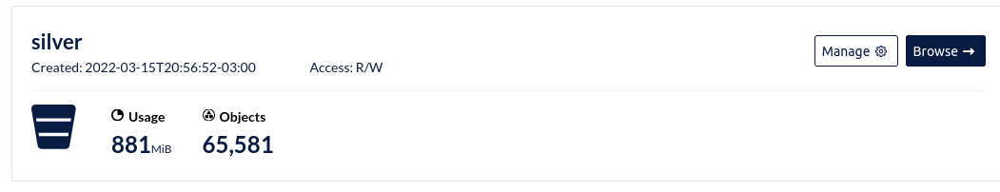

# Facens_Architecture_for_Data_Processing

O objetivo deste projeto é simular em uma escala reduzida a aplicação de tecnologias de Big Data para criação de uma repositório para Sistemas de Recomendação.

Os códigos e comentários deste repositório se referem a parte prática do TCC da pós gradução em Ciências de Dados pela Facens.

# Arquitetura

A arquitetura implementada foi a seguinte:

## Fonte de Dados

Para este projeto a principal fonte de dados utilizada, trata-se de uma API pública da Steam, com reviews de usuários em relação aos jogos. A API retorna um objeto JSON com as seguintes informações:

A API requer como parâmetro o "appid" do game que se deseja obter as informações, para isso, utilizou-se como ponto de partida um dataset já existente. O dataset em questão foi postado na plataforma do Kaggle pelo usuário Marko M. e contém 21.947.105 registros.

Dataset disponível em: https://www.kaggle.com/datasets/najzeko/steam-reviews-2021

A primeira etapa do trabalho foi carregar todos esses registros para o bucket, na camada Bronze (ingestão)

Após isso, foi aplicado um Spark job para levar os dados para a camada Silver, na qual foi aplicado um agrupamento dos dados por APPID e convertido para .parquet.

Desta forma identificou-se que no dataset haviam 65.580 possíveis jogos. Observou-se também uma redução significativa no volume dos dados.

Os dados ficaram organizados da seguinte forma neste bucket.

